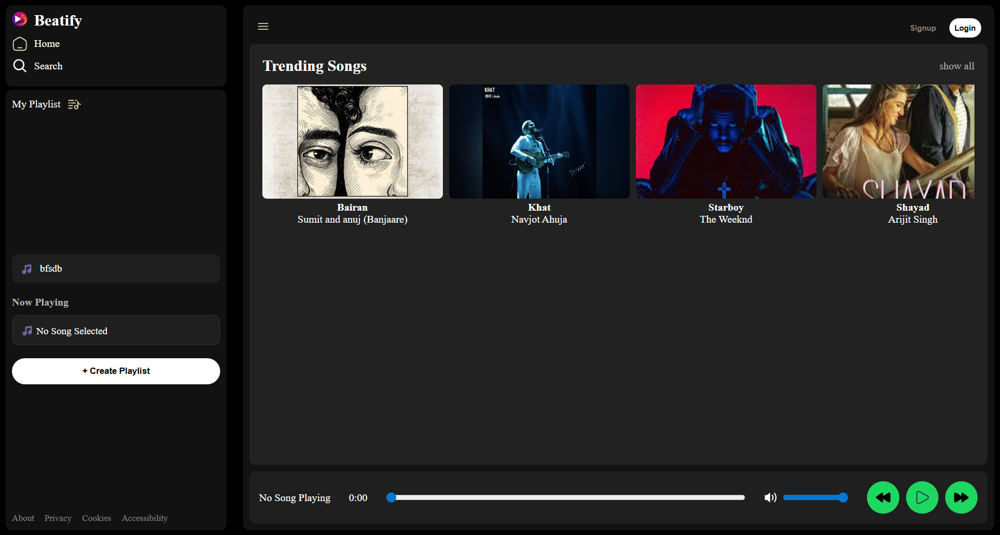
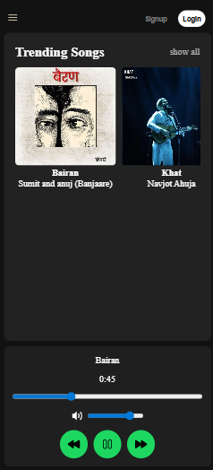

# 🎵 Beatify Music Player

Beatify is a responsive Spotify-inspired music player built using **HTML, CSS, and JavaScript**. It features dynamic song loading using JSON, playlist creation with localStorage, music controls, and a responsive mobile-friendly interface.

> 🚧 This project is still actively being improved with new features and UI enhancements.

## ✨ Features

* 🎶 Play / Pause songs
* ⏭️ Next / Previous controls
* 📊 Interactive progress bar
* ⏱️ Song timer
* 🔊 Volume control
* 📂 Dynamic song loading using `info.json`
* 🖼️ Optional album cover support with default fallback image
* 📝 Playlist creation
* ❌ Delete playlists
* 💾 LocalStorage support (playlists persist after refresh)
* 📱 Responsive mobile sidebar with hamburger menu
* 🎨 Spotify-inspired clean UI

## 🛠️ Tech Stack

* HTML5
* CSS3
* JavaScript (Vanilla JS)
* LocalStorage API
* Audio API

## 📁 Project Structure

```txt
beatify-music-player/
│── asset/
│   ├── songs/
│   ├── SVG icons
│   ├── album covers
│
│── index.html
│── style.css
│── script.js
```

## 🚀 How to Run Locally

1. Clone the repository

```bash
git clone https://github.com/YOUR_USERNAME/beatify-music-player.git
```

2. Open the project folder

```bash
cd beatify-music-player
```

3. Run using Live Server in VS Code

## 🎵 Adding New Songs

To add a new song:

1. Add the `.mp3` file inside the `asset/songs/` folder.
2. (Optional) Add an album cover image inside `asset/`.
3. Add song details in `info.json`.

Example:

```json
{
  "name": "Song Name",
  "artist": "Artist Name",
  "cover": "album8.jpg",
  "file": "asset/songs/8.mp3"
}
```

If no cover image is added, Beatify automatically uses a default cover image.

## 📌 Future Improvements

* 🔍 Search functionality
* 🏠 Functional Home/Search navigation
* ❤️ Favorites system
* 🎵 Better playlist management
* 🎨 More UI polish and animations

## 📸 Preview

### Desktop View


### Mobile View


## ⭐ Status

Actively being improved and maintained.
